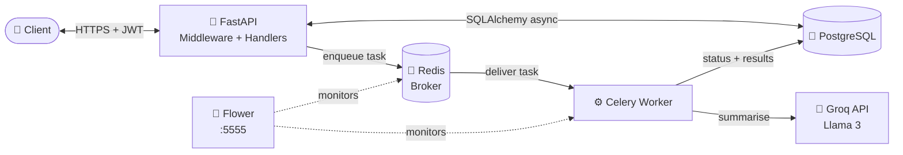
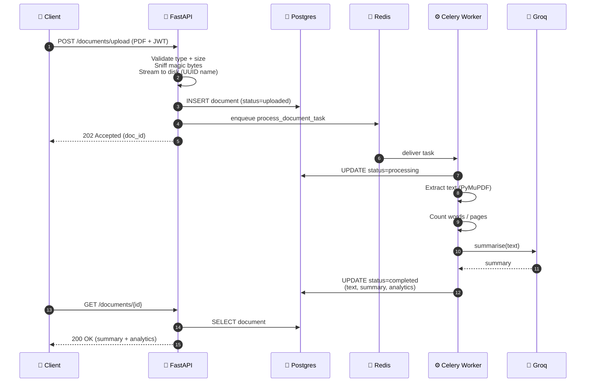
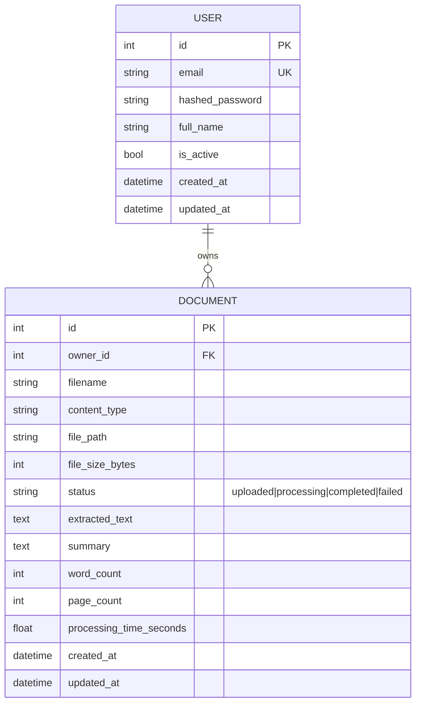
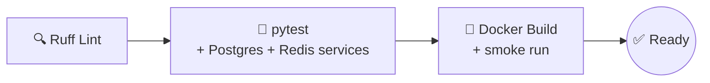

<div align="center">

# 🔍 Document Intelligence API

### _Upload a PDF. Get an AI summary. Zero blocking._

[](https://github.com/sick234/inteligenceapi/actions/workflows/ci.yml)
[](./LICENSE)
[](https://www.python.org/)
[](https://fastapi.tiangolo.com/)
[](https://www.postgresql.org/)
[](https://redis.io/)
[](https://docs.celeryq.dev/)
[](https://www.docker.com/)
[](https://github.com/astral-sh/ruff)

**A production-grade RESTful API for AI-powered document analysis.**
Built with FastAPI, Celery, PostgreSQL, Redis and Groq (Llama 3).
Async by default. Secure by design. Dockerised end-to-end.

[🚀 Quick Start](#-quick-start) · [📡 API](#-api-endpoints) · [🏗️ Architecture](#%EF%B8%8F-architecture) · [🔐 Security](#-security-hardening) · [🧪 Dev](#-development)

</div>

---

## 📚 Table of Contents

- [Key Features](#-key-features)
- [Architecture](#%EF%B8%8F-architecture)
- [Processing Flow](#-processing-flow)
- [Data Model](#-data-model)
- [Quick Start](#-quick-start)
- [API Endpoints](#-api-endpoints)
- [Usage Example](#-usage-example)
- [Security Hardening](#-security-hardening)
- [Project Structure](#-project-structure)
- [Tech Stack](#%EF%B8%8F-tech-stack)
- [Development](#-development)
- [CI / CD](#-ci--cd)
- [License](#-license)

---

## ✨ Key Features

| Feature | Description |
|---------|-------------|
| 🔐 **JWT Authentication** | Secure register/login, bcrypt hashing, password strength validation |
| 📄 **Smart Upload** | PDF + plain text, streamed to disk in 1 MiB chunks with DoS-safe size limits |
| 🧪 **Magic-byte Sniffing** | Never trusts the `Content-Type` header — real file signature is verified |
| 🛡️ **Path-Traversal Proof** | UUID-based storage + resolved-path containment check |
| 🤖 **AI Summarisation** | Groq (Llama 3) summaries generated asynchronously — API never blocks |
| ⚡ **Async Workers** | Celery background pipeline: extract → analyse → summarise → persist |
| 📊 **Analytics** | Word count, page count, processing time per document |
| 📈 **Stats Endpoint** | Aggregated stats: totals, status counts, total words analysed |
| 📑 **Pagination** | All list endpoints paginate with full metadata |
| 🏥 **Health Checks** | `/health` verifies DB + Redis connectivity |
| 🔍 **Request Tracing** | Per-request `X-Request-ID` propagated through logs |
| 📝 **Structured Logs** | Request IDs, timing, severity — ready for Grafana/Loki |
| 🚦 **Rate Limiting** | Per-route slowapi limits (auth, upload, default) |
| 🐳 **Fully Dockerised** | Multi-stage build, non-root user, `docker compose up` is all you need |
| 🌸 **Worker Dashboard** | Flower UI at `:5555` for real-time Celery monitoring |
| 🧪 **CI/CD** | GitHub Actions: Ruff lint → pytest → Docker build |
| 📖 **Auto Docs** | Swagger UI + ReDoc generated from Pydantic schemas |

---

## 🏗️ Architecture



The API **never blocks on AI**. Uploads return `202 Accepted` immediately; workers do the heavy lifting, persist the result, and clients poll `GET /documents/{id}` for completion.

---

## 🔄 Processing Flow



---

## 🗂️ Data Model



Cascade-delete: dropping a user removes all their documents. Schema is managed by **Alembic migrations** — no `create_all` in production code.

---

## 🚀 Quick Start

### Prerequisites

- [Docker Desktop](https://www.docker.com/products/docker-desktop/)
- A free [Groq API key](https://console.groq.com)

### 1. Clone

```bash
git clone https://github.com/sick234/inteligenceapi.git
cd inteligenceapi
```

### 2. Configure

```bash
cp .env.example .env
# Edit .env — fill in GROQ_API_KEY and generate a SECRET_KEY:
python -c "import secrets; print(secrets.token_urlsafe(64))"
```

### 3. Launch everything

```bash
docker compose up -d --build
docker compose exec api alembic upgrade head   # apply migrations
```

### 4. Open

| Service | URL | What you'll see |
|---------|-----|-----------------|
| 🏠 **Landing** | http://localhost:8000 | Branded HTML landing page |
| 📘 **Swagger UI** | http://localhost:8000/docs | Interactive API explorer |
| 📗 **ReDoc** | http://localhost:8000/redoc | Reference-style docs |
| 🌸 **Flower** | http://localhost:5555 | Live worker monitoring |
| 🏥 **Health** | http://localhost:8000/health | DB + Redis status |

---

## 📡 API Endpoints

### 🏥 System
| Method | Endpoint | Description |
|--------|----------|-------------|
| `GET` | `/` | Branded landing page |
| `GET` | `/health` | DB + Redis connectivity check |

### 🔐 Authentication
| Method | Endpoint | Description |
|--------|----------|-------------|
| `POST` | `/api/v1/auth/register` | Create a new user |
| `POST` | `/api/v1/auth/login` | Obtain a JWT access token |
| `GET` | `/api/v1/auth/me` | Current user profile |

### 📄 Documents
| Method | Endpoint | Description |
|--------|----------|-------------|
| `POST` | `/api/v1/documents/upload` | Upload a PDF or TXT (202 Accepted) |
| `GET` | `/api/v1/documents/` | Paginated list of your documents |
| `GET` | `/api/v1/documents/stats` | Aggregate statistics |
| `GET` | `/api/v1/documents/{id}` | Full document + AI summary |
| `DELETE` | `/api/v1/documents/{id}` | Remove document + file on disk |

---

## 🧪 Usage Example

```bash
# 1. Register
curl -X POST http://localhost:8000/api/v1/auth/register \
  -H "Content-Type: application/json" \
  -d '{"email":"demo@example.com","password":"SecurePass1","full_name":"Demo"}'

# 2. Login (OAuth2 password flow)
TOKEN=$(curl -s -X POST http://localhost:8000/api/v1/auth/login \
  -d "username=demo@example.com&password=SecurePass1" | jq -r '.access_token')

# 3. Upload a PDF
curl -X POST http://localhost:8000/api/v1/documents/upload \
  -H "Authorization: Bearer $TOKEN" \
  -F "file=@paper.pdf"
# → 202 Accepted, { "id": 1, "status": "uploaded", ... }

# 4. Poll for the AI summary
curl http://localhost:8000/api/v1/documents/1 \
  -H "Authorization: Bearer $TOKEN" | jq '{status, summary, word_count, page_count}'

# 5. Dashboard stats
curl http://localhost:8000/api/v1/documents/stats \
  -H "Authorization: Bearer $TOKEN"
```

---

## 🔐 Security Hardening

This isn't a toy demo — the upload path is defended in depth against common attacks.

| Threat | Mitigation | Where |
|--------|-----------|-------|
| **Weak secrets** | `SECRET_KEY` is required, rejects known weak defaults, enforces ≥32 chars | [`app/core/config.py`](app/core/config.py) |
| **Path traversal** | Files stored under random UUIDs + resolved-path containment check | [`app/api/documents.py`](app/api/documents.py) |
| **Content-type spoofing** | Magic-byte sniffing (`%PDF-`) reconciled against declared type | [`app/api/documents.py`](app/api/documents.py) |
| **Upload-size DoS** | Early `Content-Length` reject + streaming chunk counter | [`app/api/documents.py`](app/api/documents.py) |
| **Broken auth** | bcrypt hashing, JWT with expiry, password strength validator | [`app/api/auth.py`](app/api/auth.py) |
| **IDOR (cross-user access)** | Every query filters by `owner_id = current_user.id` | [`app/api/documents.py`](app/api/documents.py) |
| **Brute force / abuse** | slowapi rate limits per route (auth `5/min`, upload `10/min`) | [`app/core/limiter.py`](app/core/limiter.py) |
| **Missing security headers** | `SecurityHeadersMiddleware` (CSP, X-Frame, X-Content-Type, Referrer) | [`app/core/middleware.py`](app/core/middleware.py) |
| **Unbounded schema drift** | Alembic migrations are the single source of truth (no `create_all`) | [`alembic/`](alembic/) |
| **Secret leakage in logs** | Structured logger never logs tokens or request bodies | [`app/core/logging.py`](app/core/logging.py) |

See [SECURITY.md](SECURITY.md) for reporting vulnerabilities.

---

## 📁 Project Structure

```
inteligenceapi/
├── .github/
│   ├── workflows/ci.yml              # Lint → Test → Docker build
│   ├── ISSUE_TEMPLATE/               # Bug + feature templates
│   └── PULL_REQUEST_TEMPLATE.md
├── alembic/                          # Database migrations
├── app/
│   ├── api/                          # Route handlers
│   │   ├── auth.py                   # register · login · me
│   │   ├── documents.py              # upload · list · get · delete · stats
│   │   └── health.py                 # /health
│   ├── core/                         # Infrastructure
│   │   ├── config.py                 # Pydantic Settings (validated)
│   │   ├── database.py               # Async SQLAlchemy engine
│   │   ├── exceptions.py             # Global error handlers
│   │   ├── limiter.py                # slowapi rate limiter
│   │   ├── logging.py                # Structured logging
│   │   └── middleware.py             # Request-ID · timing · sec-headers
│   ├── models/                       # SQLAlchemy ORM (User, Document)
│   ├── schemas/                      # Pydantic v2 validation
│   ├── services/ai_service.py        # Groq client (retry + logging)
│   ├── worker/                       # Celery background processing
│   │   ├── celery_app.py
│   │   └── tasks.py                  # Extract → count → summarise → save
│   └── main.py                       # App factory + lifespan
├── tests/                            # pytest async suite
├── docker-compose.yml                # api · worker · db · redis · flower
├── Dockerfile                        # Multi-stage, non-root
├── Makefile                          # make dev · test · logs · clean
├── SECURITY.md                       # Vulnerability reporting
├── CONTRIBUTING.md                   # Contribution guide
└── README.md
```

---

## 🛠️ Tech Stack

| Layer | Technology | Why |
|-------|-----------|-----|
| **API** | FastAPI | Async, auto-docs, Pydantic native |
| **ORM** | SQLAlchemy 2.0 (asyncpg) | Modern async patterns |
| **Validation** | Pydantic v2 | Fast, strict, declarative |
| **Auth** | python-jose + passlib[bcrypt] | Standards-compliant JWT |
| **Queue** | Celery 5 | Battle-tested distributed tasks |
| **Broker** | Redis 7 | Low-latency, persistent |
| **DB** | PostgreSQL 15 | ACID + JSONB + full-text ready |
| **AI** | Groq (Llama 3) | Ultra-fast inference, free tier |
| **PDF** | PyMuPDF (fitz) | Fastest pure-Python PDF parser |
| **Migrations** | Alembic | Single source of schema truth |
| **Monitoring** | Flower | Real-time Celery dashboard |
| **Containers** | Docker Compose | One-command full stack |
| **CI** | GitHub Actions | Lint · test · docker build |
| **Lint** | Ruff | 10-100× faster than flake8 |
| **Tests** | pytest + pytest-asyncio | Async-native test runner |

---

## 🔧 Development

### Common commands

```bash
make dev          # Build + start everything
make logs         # Follow API logs
make logs-worker  # Follow Celery logs
make test         # Run pytest suite
make lint         # Ruff linter
make down         # Stop services
make clean        # Stop + wipe volumes
```

### Raw Docker Compose

```bash
docker compose up -d --build
docker compose exec api alembic upgrade head
docker compose exec api pytest -v
docker compose logs -f api worker
docker compose down
```

### Environment variables

| Variable | Required | Default | Description |
|----------|:---:|---------|-------------|
| `DATABASE_URL` | ✅ | — | PostgreSQL async DSN |
| `REDIS_URL` | ✅ | — | Redis broker URL |
| `SECRET_KEY` | ✅ | — | JWT signing key (≥32 chars, no weak defaults) |
| `GROQ_API_KEY` | ⚠️ | `""` | Required for AI summarisation |
| `GROQ_MODEL` | | `llama3-8b-8192` | Groq model name |
| `MAX_UPLOAD_SIZE_MB` | | `20` | Max upload size |
| `RATE_LIMIT_UPLOAD` | | `10/minute` | Upload rate limit |
| `DEBUG` | | `false` | Verbose logging |
| `CORS_ORIGINS` | | `["*"]` | Allowed origins list |

Config is validated at startup — the app refuses to boot with a weak `SECRET_KEY` or missing DSN.

---

## 🧪 CI / CD

Every push and PR runs three jobs in sequence:



Check it live: [Actions tab](https://github.com/sick234/inteligenceapi/actions).

---

## 📝 License

Released under the [MIT License](LICENSE) — free for personal and commercial use.

---

<div align="center">

**Built with ❤️ for the async Python ecosystem.**

If this project helped you, consider giving it a ⭐ on [GitHub](https://github.com/sick234/inteligenceapi).

</div>
